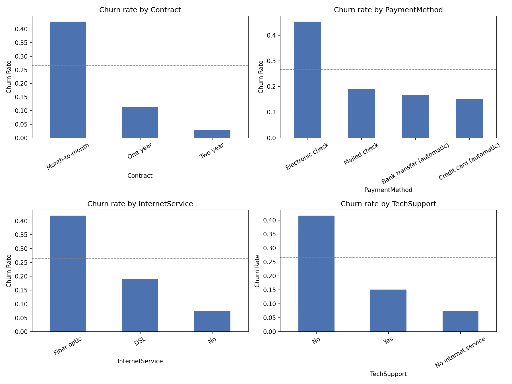
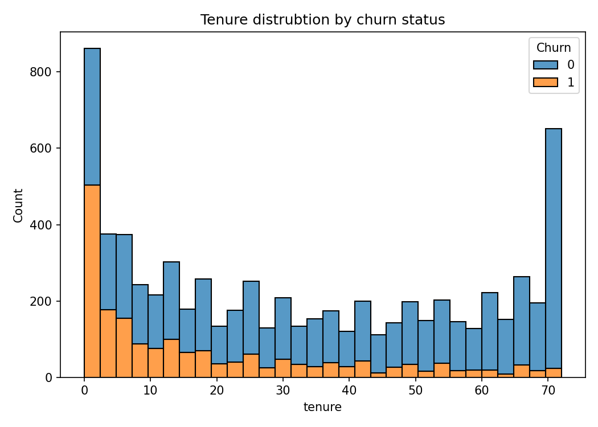
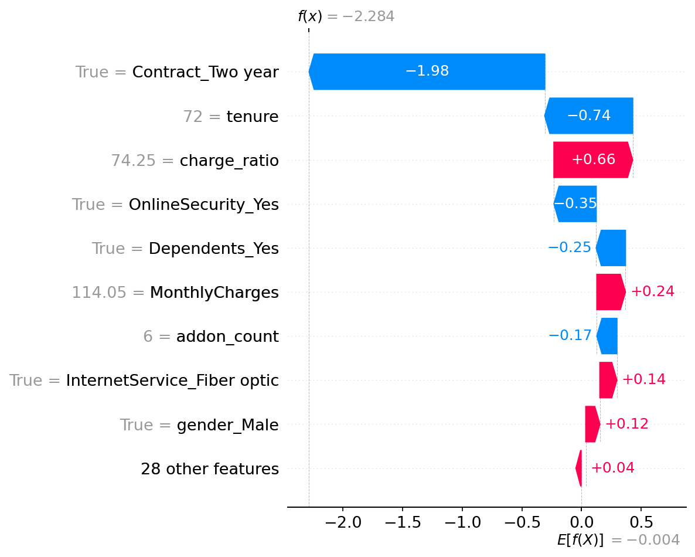
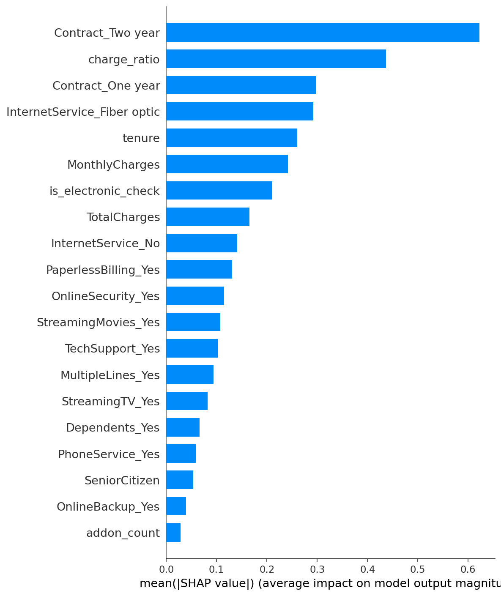

# Retention Recommendations — Telco Churn

Based on EDA (`churn_by_segment.png`, `tenure_by_churn.png`) and the XGBoost SHAP explanation (`shap_global_importance.png`, `shap_beeswarm.png`) from the trained pipeline (`outputs/model_comparison.csv`).

## Finding 1
- **What the data shows:** Contract type is the single strongest churn driver. Month-to-month customers churn at 42.7%, vs. 11.3% for one-year and just 2.8% for two-year contracts — roughly **15x** the churn rate of two-year customers.
- **Supporting evidence:** `Contract_Two year` and `Contract_One year` are the #1 and #3 ranked features by mean |SHAP value| in the XGBoost model, ahead of every other feature except the engineered `charge_ratio`.
- **Recommendation:** Target month-to-month customers with a discounted annual-contract upgrade offer, timed around the highest-risk tenure window (see Finding 3 — the first 6 months).
- **Estimated impact:** 3,875 of 7,043 customers (55%) are month-to-month,averaging $66.40/month. Even a modest 10% conversion to annual contracts (based on the one-year cohort's 11.3% churn rate) would be expected to retain roughly 390 customers who would otherwise likely churn — worth further validation with an actual CLV figure before sizing a campaign budget.

## Finding 2
- **What the data shows:** Customers paying by electronic check churn at 45.3%, more than double every other payment method (mailed check 19.1%, bank transfer 16.7%, credit card 15.2%).
- **Supporting evidence:** The engineered `is_electronic_check` flag ranks #7 by mean |SHAP value|, and this pattern holds even controlling for the other top drivers (contract, tenure, internet service).
- **Recommendation:** Prompt electronic-check customers to switch to autopay (credit card or bank transfer) with a small one-time incentive (e.g., a $10 bill credit) — autopay enrollment is a low-friction ask compared to a contract change.
- **Estimated impact:** 2,365 customers currently pay by electronic check, of whom 1,071 churned in this snapshot. Note this is likely partly a proxy, not a pure causal lever — see Limitations below.

## Finding 3
- **What the data shows:** Churn risk is heavily concentrated in new accounts: 52.9% of customers with 0-6 months of tenure churn, dropping to 35.9% (6-12mo), 28.7% (1-2yr), 20.4% (2-4yr), and 9.5% for 4+ year customers.
- **Supporting evidence:** `tenure` ranks #5 by mean |SHAP value|, and the engineered `charge_ratio` (total spend relative to monthly rate, which is naturally low for new accounts) ranks #2 overall — the single strongest non-contract signal in the model.
- **Recommendation:** Build a structured 90-day onboarding/retention touch program for new signups (welcome check-in, proactive support outreach) rather than waiting for churn-risk scores to flag them later — by the time tenure-based features dominate the risk score, the customer is already in the highest-risk window.
- **Estimated impact:** 1,481 customers (21% of the base) are in month 0-6, accounting for 784 of the dataset's ~1,869 total churned customers — disproportionately over 40% of all churn from a fifth of the customer base.

## Finding 4
- **What the data shows:** Fiber-optic customers without Tech Support churn at 49.4%, compared to 41.9% for fiber-optic overall and just 7.4% for customers with no internet service. Fiber optic churns roughly 2x higher than DSL (19.0%).
- **Supporting evidence:** `InternetService_Fiber optic` ranks #4 by mean |SHAP value|; `InternetService_No` (#9) and the TechSupport segment chart in `churn_by_segment.png` (No: 41.6% vs. Yes: 15.2%) reinforce that unsupported service is a distinct risk pocket.
- **Recommendation:** Bundle a free 2-3 month Tech Support trial into fiber plans at signup, rather than selling it as a pure add-on — this targets the highest-churn service tier with the add-on most associated with retention.
- **Estimated impact:** 2,230 customers currently have fiber without tech support; closing even a third of the gap between their 49.4% churn rate and the 15.2% Tech-Support-attached rate would be a meaningful reduction concentrated in a single, easily identifiable segment.

## Targeting strategy
- The model's precision at the top 20% riskiest-scored accounts is 0.662 (Logistic Regression) / 0.658 (XGBoost), against a 26.5% base churn rate — roughly a **2.5x lift**. Targeting the top 20% by score is a reasonable starting point: it concentrates outreach on accounts where roughly 2 in 3 are correctly flagged as actual churners, rather than spreading a campaign evenly across the whole base.
- Whether to extend beyond the top 20% (e.g. to 30-40%) depends on intervention cost vs. customer lifetime value, which isn't in this dataset — as a rule of thumb, keep expanding the targeted percentile as long as (precision at that percentile) × (average CLV) still exceeds the per-customer cost of the retention offer.

## Limitations / caveats
- This is a single-snapshot dataset with no time dimension — every finding above is a correlation, not a proven causal effect. "Month-to-month contracts cause churn" and "month-to-month customers were already going to churn and simply hadn't committed to a longer contract" are both consistent with the data.
- `is_electronic_check` is a plausible proxy rather than a clean lever: electronic check may correlate with customers who never set up autopay in the first place (a sign of lower engagement generally), not with the payment method itself driving churn. An autopay-nudge campaign should be A/B tested before assuming it will move the underlying churn rate.
- Similarly, "Fiber optic" churn may reflect price sensitivity or service-quality complaints specific to this provider's fiber rollout rather than something structurally true of fiber internet — this shouldn't be generalized beyond this company's dataset.
- `TotalCharges` and the engineered `charge_ratio` are mechanically correlated with `tenure` (new customers have low total charges almost by definition), so some of their SHAP importance is likely restating the tenure effect rather than adding independent signal.

## Appendix
Below are the outputs: `churn_by_segment.png`, `tenure_by_churn.png`, `shap_beeswarmer`, `shap_customer_0`, and `shap_global_importance`
### churn_by_segment

### tenure_by_churn

### shap_beeswarmer

### shap_customer_0

### shap_global_importance

## Other files
Other files, like `X_test.csv`, `X_train.csv`, `y_test.csv`, and files related to the XGB Model are in the `outputs/` folder.

